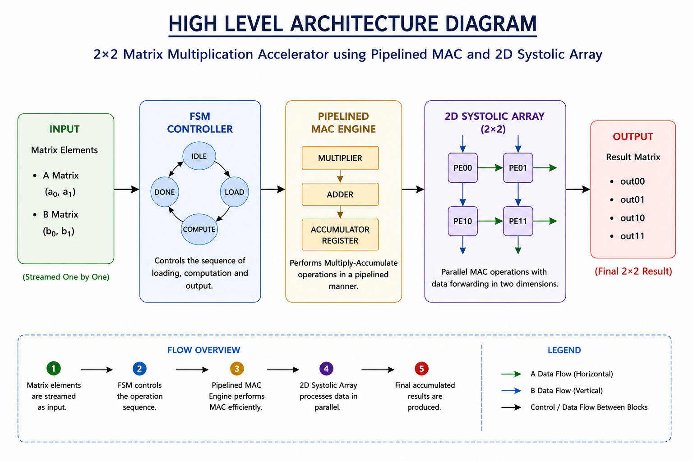

# Verilog RTL Based Pipelined 2D Systolic Array AI Accelerator

## Overview

This project is a Verilog-based hardware accelerator designed using a 2D systolic array architecture. The system performs matrix-style multiply-accumulate (MAC) operations using interconnected Processing Elements (PEs), pipelined computation, and FSM-based control logic.

The project demonstrates important frontend VLSI concepts such as:
- RTL design
- Pipelining
- FSM controller design
- Parallel processing
- Systolic dataflow
- Distributed computation
- Matrix multiplication acceleration

The architecture is inspired by modern AI accelerator concepts used in tensor processors and systolic-array-based compute engines.

## Key Features

- Verilog HDL based RTL implementation
- Pipelined MAC (Multiply-Accumulate) architecture
- FSM-based control path
- Parameterized scalable NxN systolic array architecture
- Processing Element (PE) based distributed computation
- Parallel matrix-style computation
- Parameterized RTL modules
- Waveform verification using GTKWave
- Modular and scalable architecture

## Project Flow

Input Matrix Elements
        ↓
FSM Controller
        ↓
Pipelined MAC Engine
        ↓
2D Systolic Array
        ↓
Distributed Accumulation
        ↓
Output Results

## Processing Element (PE)

Each Processing Element performs:

1. Multiply-Accumulate (MAC) operation
2. Data forwarding to neighboring PEs

MAC operation:

acc_out = acc_in + (a×b)

The PE also forwards input data horizontally and vertically through the systolic array.

## Technologies Used

- Verilog HDL
- Icarus Verilog
- GTKWave

## Folder Structure

project/
│
├── rtl/
│   ├── mac_unit.v
│   ├── pipelined_mac.v
│   ├── pe.v
│   ├── systolic_array.v
│   ├── systolic_nxn.v
│   ├── matrix_mul.v
│   ├── controller.v
│   └── accelerator_top.v
│
├── tb/
│   ├── systolic_nxn_tb.v
│
├── waveforms/
│   ├── *.vcd
│   └── *.png
│
├── docs/
│   ├── High_Level_Architecture.png
│   └── Systolic_Array_Architecture.png
│
└── README.md

## Simulation and Verification

The design was verified using:

- Testbenches
- Waveform analysis
- GTKWave simulation

Waveforms were used to verify:

- PE communication
- Data forwarding
- Partial sum accumulation
- Systolic dataflow
- Correct output generation
- Scalable NxN PE mesh operation

## Example Outputs

For sample inputs:

a0 = 2
a1 = 3

b0 = 4
b1 = 5

Outputs obtained:

out00 = 8
out01 = 18
out10 = 12
out11 = 27

## Future Improvements

Possible future upgrades:

- FPGA synthesis and implementation
- AXI interface integration
- Memory buffering support
- Quantized INT8/INT4 computation
- Higher-dimensional matrix operations

## Conclusion

This project demonstrates the implementation of a parameterized scalable NxN AI-oriented accelerator architecture using Verilog RTL. It combines pipelined MAC computation, scalable Processing Element (PE) mesh architecture, and systolic-array-based distributed processing to perform efficient matrix-style operations in hardware.